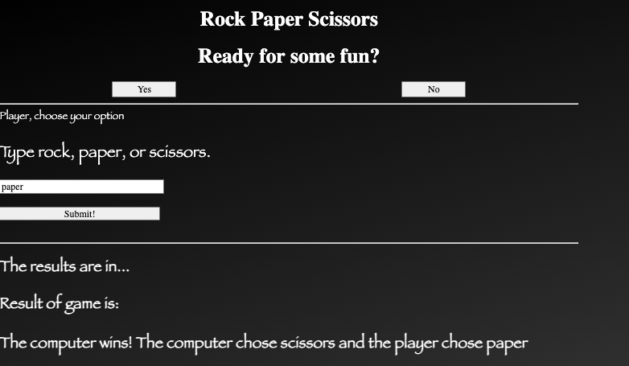

# Rock Paper Scissors Game

---

# Intro

This project was completed in January 2024 as part of my pre-work for General Assembly after completing a 20-hour course on the basics of HTML, CSS, and JavaScript.



---

# How to Play

The game asks if the user is ready to play: Yes or No. Injectng some humor, if the user clicks "No", they are told that "Wrong. You are ready. Go Click Yes." Once, they click "Yes", the instructions for the game come appear as "Player, choose your option"

Next, the player has to type rock, paper, or scissors and clicks submit. The computer makes its randomized choice as well. Then, the results are populated below- letting the player know if it was a tie, or whether the user or computer won. Additionally, the user will be able to see what the computer chose too.

---

# Functionality

The JavaScript code leverages basic JavaScript functons and DOM manipulation.

## Ready to Play : Yes/No

There are two functions- `answerYes` and `answerNo`. Both the "yes" and "no" button has an event listener. Once clicked, the message that appears in the #response div below will be updated based on whether "yes" or "no" was clicked.

## Validation

To ensure that the player input is only one of the following- rock, paper, scissors- validation is built in with an if/else statement. We only want the game to run if the player has entered one of those 3 choices (and we used `.toLowerCase` so that it's not case sensitive).

If the choice input does not match, an alert pops up to advise the player to "Please type options exactly: rock, paper, scissors." Otherwise, the compareChoices function runs to help determine the outcome of the game.


## Computer Choice

We use an array titled `gameOptions` to list the options out. To randomize what the computer chooose, we used math floor and math random in the function `computerChooses()`. The math object of math random selects a number from 0 to up to 1- this is then mutliplied by 3. The math.floor rounds it down so we will only get 0,1,2 for the answer- which represent the positions of the choices in the array.

We set variable of `computerChoice` to be equal to the output of that randomized function- which gives us whether computer chose rock, paper, or scissors.

## Compare Choices

To compare what the computer chose and what the player chose, we have the function `compareChoices()`. This uses if/else statements. There are 3 "branches" to represent combinations that player and computer can choose to result in:

- computer winning
- player winning
- tie

Each "branch" of that if/else statement has a `displayResult` function attached to it - that will display the result of who won and what the player and computer chose. This text is appended in the resultText div at the bottom section of the game.

## Tying It Together

So how does it all tie together and how do we ulimately see the result?

`playerChose()` is executed when player clicks Submit. Then, the system validates the player's choice and whether it matches rock, paper, or scissors. If so, then it runs `compareChoices()` which compares what the computer chose output calculated by `computerChoose()` vs what the player chose.

Within `compareChoices()` function, based on what the computer and player chose, the `displayResult()` function then displays the result and who won.

---

# What I Learned

## Array Naming Convention

If the indices of an array have some semantic meaning, it's better to assign a name to the indices of the array rather than the elements.

With the gameOptons array, we assign the index position to a variable name.

```
const gameOptions = ["paper", "scissors", "rock"];
const Paper = 0;
const Scissors = 1;
const Rock = 2;
```

This way, when we "call them" later in the if/else statements when comparing computer vs player choice- we refer to them as `gameOption[Paper]` etc as it's easier to understand.


## toLowerCase()

This was used for validating player input was one of the 3 choices of rock, paper, scissors. By adding this, it ensures that regardless of case, as long as the character typed in the input box match, the option would be accepted.

## DOM Best Practice

You want to typically avoid adding or deleting HTML elements because it's "expensive" to modify the DOM and can cause a redraw. Redraw means that everytime the page is modified through DOM, the browser needs to redraw the affected parts of the pages to reflect these changes. Excessive redraws can degrade the page's performance and responsiveness.

This is why in this case we update the div's inner text vs creating a new line of a message when the button of yes/no is clicked at the beginning of the game.


